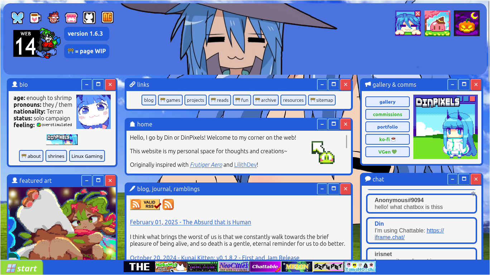
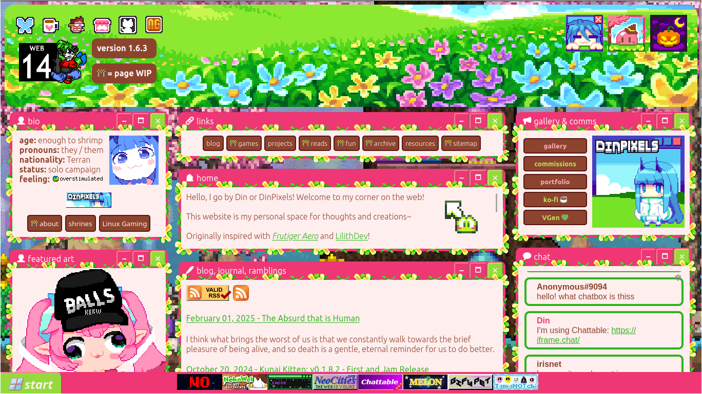

# [DinPX.github.io](https://dinpx.github.io/)
My static personal website that is [hosted on Neocities](https://dinpixels.neocities.org).

<table>
    <tr>
        <td colspan="2"></td>
    </tr>
    <tr>
        <td></td>
        <td></td>
    </tr>
</table>

It is a hobby project as well as a personal site for my creations and thoughts, which aesthetics and functionalities are not only inspired by the modern time but also (a bit heavily) by the early 2000s.

As the webpage is inspired by the old web, it has a music player, a pet sim and Tamagotchi-inspired pet, a more personalized theme, and buttons and graphics alike which are commonly used back then.

## Features
- Animations can be turned off with `prefers-reduced-motion`
    - Helpful for visitors who want/need less motions
- Theme options (on the top right corner of the banner)
- Chat box powered by [Chattable by xobyte](https://iframe.chat/).
- Tooltips on hovered items by [xobyte](https://andrew-grider.com/).
- Pet sim game powered by [GifyPet by MelonKing](https://gifypet.neocities.org/).
- Tamagotchi-inspired pet powered by [tamaNOTchi!](https://tamanotchi.world/).
- Mobile layout (still in need for more adjustments to UI)
- RSS feed for blogs and other updates
- My personal music playlist (as of Q4 2024)

## To-do
- [ ] My manifesto (internet, webpage, freedom)
- [x] Script for showing featured images (even 'daily' memes)
- [x] Fix mobile UI
- [ ] Add games section on homepage
- [ ] Update games page
    - ~~Show games list and devlogs on the same page~~
- [ ] Update RSS formatting
- [x] Theme toggle (between classic blue XP and current sakura theme)
- [ ] Host to Nekoweb

## Copyright
### Featured Art, Pixel Art, etc.
I own and have the rights to all the pixel art (art, artworks, fanarts, illustrations) in all pages, unless otherwise stated, especially the pieces under Gallery and Commissions pages.

I do not allow any form of training or selling them in any way or form (e.g. Gen AI, NFTs, crypto, Ko-fi, itch.io, and alike).

### Website Buttons and Other Graphics
The buttons, which most are 88x31 in size, are owned by their respective authors, and are under permission to be used in means of sharing their websites. The same applies to other graphics that are not specifically owned by anyone, e.g. a cropped screenshot from an anime episode, sticker GIFs, etc.

### Music
All music/audio used in the music player belongs to their respective authors.  
(I'm putting here the links to remixes, covers, and alike because they're just peak.)
- **Another colony by TRUE**
    - **Spotify:** [Track](https://open.spotify.com/track/6PhLTa3YsokPwiWbztNeYp)
    - **YouTube:** [MV](https://www.youtube.com/watch?v=x2wUyP0l4bw) | [TV size](https://www.youtube.com/watch?v=lzQgZRt4wGc) | [Tender mix](https://www.youtube.com/watch?v=C7a-V1pGBjQ)
    - **Covers:** [ENG cover](https://www.youtube.com/watch?v=6Lw-xjxiWQw) by [Angela (Studio Yuraki)](https://twitter.com/bonbonangel_/status/1416837917062819840)
- **My Friend (ぼくのフレンド) by mewhan**
    - **Spotify:** [Track](https://open.spotify.com/track/5AH0F230K1ab9TPYUA3wR5)
    - **YouTube:** [Music only](https://www.youtube.com/watch?v=83xwNaTUB54) | [MV TV size](https://www.youtube.com/watch?v=LOKM9Gl3cA4) | [Serval and Kaban and Common raccoon and Fennec (SAFARI DRIVE)](https://www.youtube.com/watch?v=NTsvgqRwUIc)
- **cobalt (コバルト) by MOB CHOIR**
    - **Spotify:** [Track](https://open.spotify.com/track/4O8puCX5HdcMUn6JvCuAbC)
    - **YouTube:** [Music only](https://www.youtube.com/watch?v=NWwDm5AUFFw)
- **PINK BLOOD by Hikaru Utada**
    - **Spotify:** [Track](https://open.spotify.com/track/39lq5gU4lPc0rYVaRo0stH)
    - **YouTube:** [Music video](https://www.youtube.com/watch?v=U_Ry2dM0B34)
- ...and more links to be added here soon.

### Issues
If there are any images or other assets/works that have been used without permission and would like to be removed, feel free to [contact me](mailto:dinpixels@proton.me) to take it down.